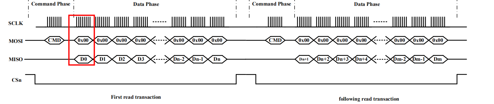

## ArduCAM OV2640 Mini 2MP PLUS on ESP32

### How to use

Pin connection: the ArduCAM Mini 2MP Plus module has 8 pins, connect them to the esp32 as following.

| ArduCAM | ESP32   |
| ------- | ------- |
| CS      | GPIO 5  |
| MOSI    | GPIO 23 |
| MISO    | GPIO 26 |
| SCK     | GPIO 18 |
| GND     | GND     |
| VCC     | 3V3     |
| SDA     | GPIO 21 |
| SCL     | GPIO 22 |

### Camera module

There are two types of OV2640 module available. 

The original camera chip released by **Omni Vision** uses more than 10 pins (with a typical parallel data port D0-D7). Most ESP32 application uses driver developed for this version. The ESP-CAM breakout board also falls into this category.

The "MINI" version with SPI released by **ArduCAM** has attached an additional ArduCAM chip for data transfer. The camera configuration is still done through I2C with the camera chip directly, but the data is read by the AruCAM chip and buffered in its internal storage. This brings us a nice 6-line interface (2 for I2C, 4 for SPI) excluding power line, which significantly saves the number of GPIO pins.

### SPI burst reading timing

In some out-dated datasheet of the OV2640-MINI-2MP module it is mentioned that user should discard the first byte read in SPI burst reading mode because it is a dummy byte. However, this (weird) behavior is fixed in OV2640-MINI-2MP-**PLUS**. 

Following is the correct SPI timing, for more details see [ArduCAM FAQ](https://www.arducam.com/docs/spi-cameras-for-arduino/faq/).

### JPEG format

The JPEG format is a compress format of image data with a compress factor of about 25 (4% of original size). For example, an bitmap image of resolution 640x480 and output format RGB565 (each pixel 2 bytes) has a size of 614KB. In JPEG format it only takes aboyt 25KB. Reversely speaking, with the same storage size a JPEG image allows larger resolution.

It takes much computation power to compress and decompress an JPEG image. Fortunately, the OV2640 module has an internal JPEG compressor. When the image format is configured to JPEG, the camera module outputs already the compressed data. The microprocessor just need to read it out and transfer the compressed data to the edge device. No local decompression or further processing is done inside the microprocessor because that will take a long time. Decompression and visualization of the image could be done by the consumer for example a web browser.

A JPEG image binary starts with `0xFFD8` and ends with ` 0xFFD9 `. 

### Added C wrapper functions

Added C wrapper functions to `ArduCAM_esp_ov2640.cpp` and `ArduCAM_esp_ov2640.h` so the library can be used in the C language.

`myCAM = (ArduCAM_OV2640_C *)ArduCAM_OV2640_init(CS_PIN);` should be called at the begining of `app_main()` to populate `ArduCAM_OV2640_C *myCAM;` a container to access the `ArduCAM_OV2640` class.
