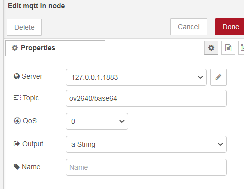

## ArduCAM low resolution image example

### How to use

1. hardware: connect the pins as mentioned in the readme file in the root folder 

2. software

go to `network_common.h` and set the constants 

| name   | description   |
| ------ | ------------- |
| MYSSID | Wifi SSID     |
| MYPWD  | Wifi password |
| MYMQTT | mqtt url      |

3. nodered

In nodered, import the "ov2640_320x240_streamcapture" flow. You will need to install one community-contributed node called [message-counter](https://flows.nodered.org/node/node-red-contrib-message-counter).

change the mqtt broker url to your own url and change the topic name if you have modified it.

### Base64 format

A binary buffer cannot be transferred through MQTT directly. Base64 is a common format to convert a binary buffer to a text string.

Base64 uses 64 ASCII symbols (A-Z, a-z, 0-9, + and /) to encode binary buffers, each symbol represents 6 bits. Since each ASCII symbol size is one byte (8 bits), the encoded base64 string will be 33% bigger than the original binary buffer.

When the number of bytes is not multiple times of 3 (3*8=24bits = 4 Base64 symbols), the original buffer will be padded by 0 so that the number of bits can be multiple times of 6.

### internal buffers

in this example, we set image format to JPEG and use a "binary buffer" to store the raw compressed binary. Another larger "encode buffer" is used to store the encoded Base64 string. 

For low resolution images, the compressed data size is several kilobytes (Note that ESP32 has 180K bytes memory). So we just use a single buffer to store the image. The user is responsible to allocate a sufficiently large buffer to hold the compressed binary. The buffer size is same to the maximum transfer size of the esp-spi-driver `SPI_MAX_TRANS_SIZE `.

